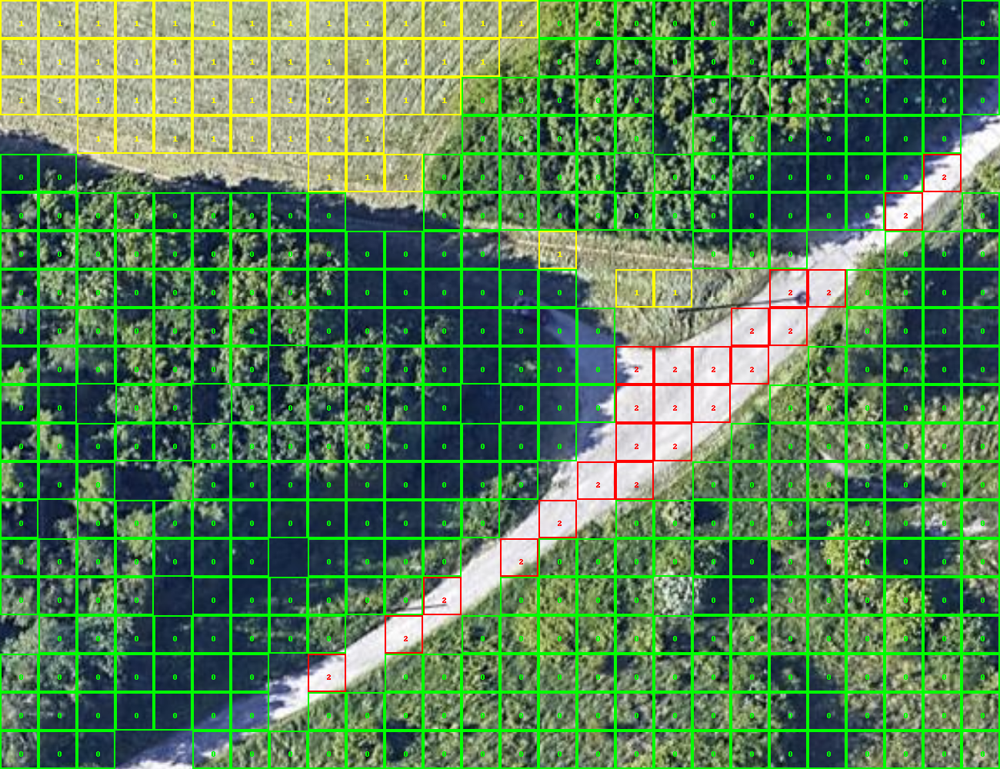

# aero_photo_classifier
Generative type of classifficaiton algorithm applied to aero photo classification

This algorithm was developed in SSU. This repo is a port from a legacy Java version with some minor extensions, 
such as building plots for Kulbak criterion relation to the radius of the class descripting sphere

Example of tiles classification (Class 1 - yellow - field, Class 2 - red - road,
Class 0 - lime - forest):

